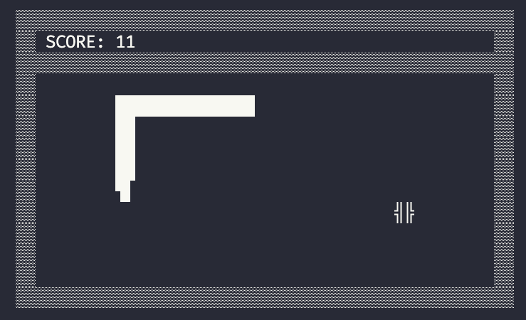
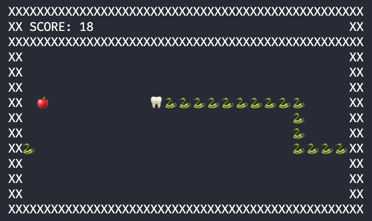
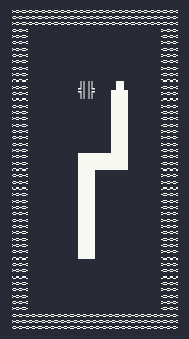
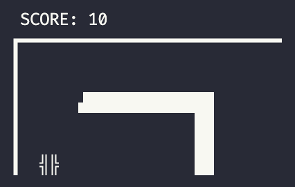

# Terminal Snake

A highly customizable snake game in your terminal.






## Installing and running

Clone the repository and cd into the directory. Run the main script to get started:

```zsh
python main.py
```

The project doesn't rely on any external packages, so there's no need to set up a virtual environment or pip install anything.

### Controlling the snake

Use arrow keys to control the snake. Eat apples to grow in size.

## Note for Windows
Controlling the snake is currently not supported on Windows. There are plans to Windows support soon.